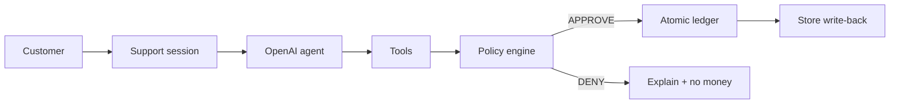

# Jobform — Policy-Governed AI Refund Support

[](https://nextjs.org/)
[](https://www.typescriptlang.org/)
[](https://www.sqlite.org/)
[](https://platform.openai.com/)
[](#how-it-works)

A production-shaped **AI customer-support product** for e-commerce refunds.

The model runs the conversation. A **deterministic policy engine** decides eligibility and amount. A transactional ledger writes the refund. The LLM **cannot** approve money the policy would deny.

Live storefront integration: **NovaShop** customers open Jobform from an order. Approved refunds write back to the store (return status, pickup, tracking).

### Product walkthrough

<p align="center">
  <a href="https://youtu.be/88rlO-5ko54">
    
  </a>
</p>

<p align="center">
  NovaShop → order context → AI support → policy → refunds
  <br /><br />
  <a href="https://youtu.be/88rlO-5ko54"><b>Watch demo on YouTube</b></a>
  &nbsp;·&nbsp;
  <a href="https://jobform-production.up.railway.app">Live app</a>
  &nbsp;·&nbsp;
  <a href="https://jobform-production.up.railway.app/support">Support portal</a>
</p>

---

## What this project does

This is not a chatbot demo with a fake “approved” badge. It is a vertical slice of a real support product:

- **Stage 1 — conversation.** A support agent (OpenAI Responses API, function calling) gathers reason, item, quantity, and condition.
- **Stage 2 — policy.** Fifty machine-checkable rules (account, order, window, item, reason, condition, amount) evaluate the request.
- **Stage 3 — execution.** An atomic SQLite transaction re-validates policy, enforces idempotency, and writes the ledger.
- **Stage 4 — store write-back.** Jobform notifies the commerce backend so the customer sees refund / pickup / return tracking.

The evaluated path uses **real persistence, real tool orchestration, and real policy** — not mock UI.

---

## Demo

| Surface | URL |
| --- | --- |
| Product home | `/` |
| Customer support | `/support` |
| Staff console | `/login` → `/admin` |
| Health | `/api/health/live`, `/api/health/ready` |

**Typical refund path**

```text
Store order (delivered)
        -> signed support launch or portal lookup
        -> agent chat (text or microphone)
        -> validate_refund_request (policy)
        -> execute_refund (ledger)
        -> NovaShop refund-completed webhook
        -> Pickup scheduled + return tracking on the store account page
```

Refunds are **per line-item quantity**, not the full order total. Two units at $120 each: asking for “the Nike” with quantity `1` refunds **$120**; remaining balance stays on the order.

---

## How it works

### Support pipeline

1. Bind one **customer** to one **owned order** for the session. The agent cannot switch identity.
2. Persist the customer message and open an **agent run** with structured events.
3. The model may call tools only: lookup customer, load order, read policy, validate, execute, escalate.
4. `validate_refund_request` is the sole authority for **APPROVE / DENY** and **amount**.
5. `execute_refund` re-runs policy inside a transaction and writes the ledger, or returns the same row on a true replay.
6. SSE streams activity to the customer UI. Admin **Runs** and **Refunds** read the same tables.

### Policy pipeline

1. Staff enable/disable checks on `/admin/policy` (full 50-rule checklist).
2. Runtime loads the **active** policy. At least one enabled rule is required.
3. Each enabled rule is an evaluator against live customer / order / request data.
4. Amount = `unitPriceCents × requestedQuantity`. Shipping is excluded.
5. Failed checks become `denialReasons` the agent must explain — not override.

### Voice pipeline

Voice is a **transport**, not a second agent.

```text
Microphone -> Realtime transcription-only WebRTC
           -> same /api/support/chat
           -> same policy + ledger
           -> persisted AGENT message
           -> server-side TTS (streamed playback)
```

The browser never receives the long-lived OpenAI key. TTS synthesizes only a persisted agent `messageId`.

### Commerce sync

```text
NovaShop  --HMAC-->  Jobform business context / support launch
Jobform   --pull-->  store export-all (startup + every 5 min)
Jobform   --HMAC-->  store refund-completed (ledger write-back)
```

---

## Architecture

```text
┌──────────────────────────────────────────────────────────────────────────┐
│                         Jobform (one Next.js app)                        │
│                                                                          │
│   /support UI          /admin console         signed integration APIs    │
│        │                     │                        │                  │
│        v                     v                        v                  │
│   session bearer        staff cookie /            HMAC + timestamp       │
│   + SSE chat            optional gateway          + event-id replay      │
│        │                                                                  │
│        +---- Responses agent loop (untrusted orchestration) ----+        │
│        |                                                        |        │
│        v                                                        v        │
│   tool registry                              policy evaluators (50)     │
│        |                                                        |        │
│        +---------------- execute_refund (SQLite txn) -----------+        │
│                              |                                           │
│                              v                                           │
│                    refunds ledger + outbox                               │
│                              |                                           │
│                              v                                           │
│                    ecommerce refund notify                               │
└──────────────────────────────────────────────────────────────────────────┘
```



**Offline / ops workflow:** catalog sync → policy version → chat runs → refund ledger → notifications / retention jobs.

**Interactive workflow:** React UI → App Router APIs → services → SQLite → SSE / admin reads.

---

## Authority model

| Actor | May | May not |
| --- | --- | --- |
| **LLM** | Choose tools, ask questions, explain outcomes | Write the ledger, pick the amount, mint idempotency keys, switch customer/order |
| **Policy engine** | Approve/deny and compute item refund cents | Talk to the customer |
| **Execution service** | Re-validate and persist an idempotent refund | Trust a prior model “APPROVE” without rechecking |
| **Voice Realtime session** | Transcribe one speech turn | Call refund tools |

Model output is treated as **untrusted orchestration input**.

---

## Key features

- **Deterministic 50-rule catalog** grouped by account, order, time, item, reason, condition, and amount
- **Single live policy** — check/uncheck, save; no draft/publish maze for operators
- **Idempotent refund execution** with in-transaction revalidation
- **HMAC-signed store integration** (canonical customer/order snapshots)
- **Automatic e-commerce pull** plus refund write-back
- **Human escalation** when automation is unsafe
- **Voice in / voice out** without a second reasoning agent
- **Staff operations:** runs, customers, refunds, policy, escalations, system
- **Privacy retention** and notification outbox

---

## Project structure

```text
src/
|-- app/                         # App Router: product, support, admin, APIs
|-- components/                  # Chat, policy manager, admin UI
|-- domain/refunds/              # Policy catalog, evaluators, types
|-- services/
|   |-- agent/                   # Tool loop, prompt, retry bounds
|   |-- refund-eligibility.service.ts
|   |-- refund-execution.service.ts
|   |-- integrations/            # Store pull, HMAC sync, refund notify
|   `-- voice/                   # Transcription credential + speakable messages
|-- tools/agent/                 # Strict tool schemas and implementations
|-- repositories/                # SQLite read/write models
|-- security/                    # Session, HMAC, rate limits, admin
|-- integrations/openai/         # Responses + Realtime + TTS adapters
|-- db/                          # Schema, migrate, seed, purge
tests/                           # Eligibility, agent loop, voice, production foundation
docs/                            # Architecture, deployment, integrations, phases
```

---

## Tech stack

| Layer | Technology | Why it is used |
| --- | --- | --- |
| Product UI | Next.js 16 App Router + React 19 | One deployable app for customers, staff, and APIs |
| Language | TypeScript | Shared contracts from policy codes to HTTP |
| Persistence | SQLite (`better-sqlite3`) | Immediate transactions for money-safety on a single instance |
| Agent | OpenAI Responses API | Function calling without giving the model a ledger |
| Policy | In-process evaluators | Machine-checkable rules; not prose as financial authority |
| Voice in | Realtime WebRTC, transcription-only | Mic without a second refund agent |
| Voice out | OpenAI TTS (`tts-1` default) | Speak persisted agent text; stream first audio chunks |
| Store | HMAC JSON over HTTPS | Canonical snapshot in; refund event out |
| Hosting | Docker + persistent volume | SQLite needs a writable disk (Railway / similar) |

---

## Flow summary

**Customer refund:** `portal/host launch -> session token -> chat/voice -> tools -> policy -> ledger -> store webhook`

**Staff policy:** `/admin/policy -> enable checks -> Save -> runtime evaluators`

**Observability:** `agent_runs` + `agent_events` + refunds table → admin Runs / Refunds

---

## Setup

1. Clone and install:

```bash
npm ci
cp .env.example .env.local
```

2. Set at least `OPENAI_API_KEY`, `ADMIN_EMAIL`, `ADMIN_PASSWORD` (12+), and the 32-character secrets listed in `.env.example`.

3. Bootstrap local catalog (optional sample data):

```bash
SEED_SAMPLE_CATALOG=true npm run db:bootstrap
npm run dev
```

4. Open `/support` or `/login`.

### Connected store

Set `ECOMMERCE_BASE_URL` and the same `BUSINESS_INTEGRATION_SECRET` on Jobform and the store. Jobform pulls orders on startup and every five minutes, and posts `refund-completed` after a ledger write.

### Commands

```bash
npm test
npm run ci:check
npm run production:preflight
```

### Deployment

One application instance, mount `/app/.data` for SQLite. See `docs/deployment.md`.

```bash
docker compose -f docker-compose.production.yml up --build -d
```

---

## Design choices (for reviewers)

- **Policy over prompt.** Refund money is a compiler-shaped checklist, not “the model seemed confident.”
- **Re-validate at write time.** A skipped or stale `validate_*` call cannot complete a refund.
- **Voice is I/O.** Transcription and TTS never own eligibility.
- **SQLite on purpose for this slice.** Repositories isolate SQL so Postgres is a later hosting change, not a rewrite of authority.
- **No fake catalog in production.** Sample customers seed only when `SEED_SAMPLE_CATALOG=true`.

Deeper write-up: [`docs/architecture.md`](docs/architecture.md) · integrations: [`docs/integrations.md`](docs/integrations.md) · policy: [`docs/refund-policy.md`](docs/refund-policy.md) · voice: [`docs/phase-5.md`](docs/phase-5.md)

---

## Scope that is explicit, not hidden

This launch does **not** claim: native multi-tenant SSO/RBAC, payment-processor settlement, managed Postgres + distributed workers, or compliance certification.

It **does** claim a real support path: persisted sessions, tool-using agent, deterministic refunds, store sync, and staff operations.
