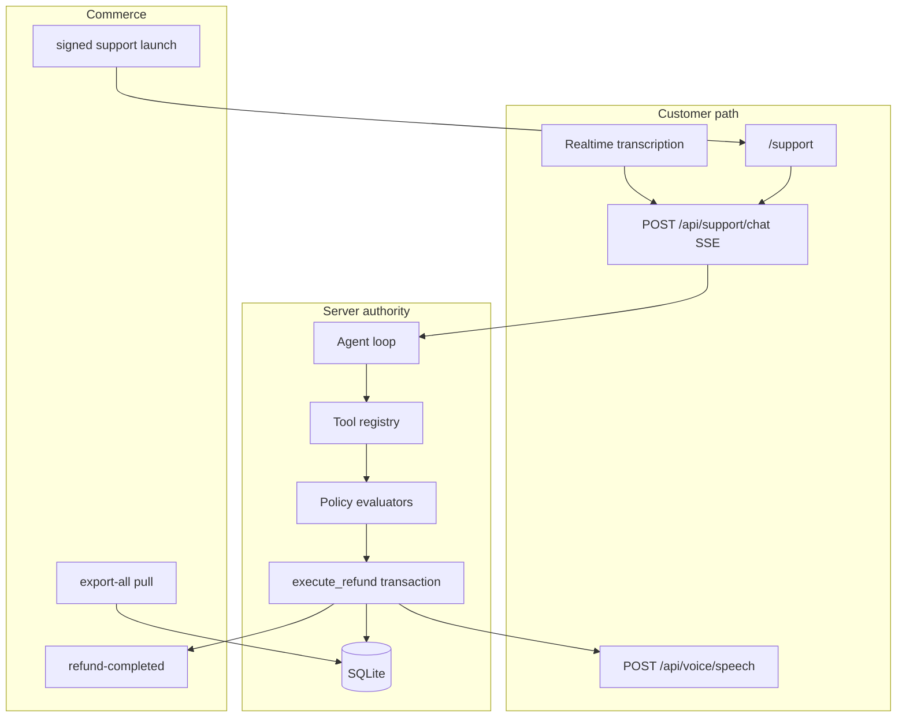

# Architecture

Jobform is **one Next.js application** with internal module boundaries — not a mesh of microservices. The interesting split is **authority**, not process count: the LLM orchestrates; policy and the ledger decide money.

## Flow summary

**Offline / ops:** store pull → policy checklist → agent runs → refund ledger → notification drain / retention

**Interactive:** customer UI → session capability → Responses agent → tools → policy evaluators → SQLite transaction → SSE + admin reads → store webhook

```text
Data / orders  ->  Stage 1 agent  ->  Stage 2 policy  ->  Stage 3 ledger  ->  store write-back
                       |                  |                  |
                  function calls     50 evaluators     idempotent txn
```



## Why this shape

| Problem | Approach |
| --- | --- |
| Model hallucinates eligibility | Deterministic evaluators; model cannot override |
| Double refunds | Server-owned idempotency key + unique ledger intent |
| Mic as a second brain | Transcription-only Realtime; same chat path |
| Store drift | HMAC snapshots in; refund events out |
| Staff confusion | One live policy, full checklist, save in place |

## Deployment boundary

Jobform is one Next.js App Router application. Concerns are separated internally rather than split into premature services.

## Module boundaries

- `src/domain/refunds` — domain types, machine-checkable policy, refund execution contracts.
- `src/services/refund-eligibility.service.ts` — deterministic approval/denial and amount calculation.
- `src/services/refund-execution.service.ts` — atomic money-safety boundary and idempotency.
- `src/db` — SQLite migration/database/seed lifecycle.
- `src/repositories` — SQLite customer/order, support-session, agent-run, and admin read models.
- `src/tools/agent` — strict LLM tool schemas, validation, authorization, tool implementations.
- `src/services/agent` — model-independent orchestration, retry policy, prompt, loop guard.
- `src/integrations/openai` — narrow Responses API and voice-transport adapters.
- `src/app/api` — HTTP/SSE transport over the same server-side services.
- `src/app` / `src/components` — presentation only.

## Authority model

```text
LLM
  can: choose tools, ask questions, explain outcomes
  cannot: authorize money, set authoritative timestamps, choose auth identity,
          choose execution idempotency, or write the ledger

Deterministic refund engine
  owns: rule evaluation + authoritative refund amount

Refund execution service
  owns: final in-transaction revalidation + idempotent ledger write
```

Model output is therefore treated as untrusted orchestration input.

## End-to-end text path

```text
Customer UI
   |  portal: email + order ID lookup -> session bearer capability
   |  host: signed one-time launch -> session bearer capability
   |
   | POST /api/support/chat (session authorization rechecked)
   v
Support session boundary
   |
   v
Responses API agent loop
   |
   +--> customer/order tools
   +--> refund policy retrieval
   +--> deterministic validation
   +--> atomic refund execution
   |
   v
SQLite
   +--> support messages
   +--> agent runs
   +--> agent events
   +--> completed refunds
   |
   +--> SSE customer activity
   +--> Admin Runs / Refund Ledger
```

The transport layer validates request shape, resolves server-owned support context, invokes the service layer, and serializes persisted results. It never evaluates refund policy itself.

## Agent loop

1. Persist `agent_run` and `REQUEST_RECEIVED`.
2. Send customer message + authenticated support context to the model.
3. Receive zero or more function calls.
4. Validate JSON/tool arguments against application-side validators.
5. Enforce customer/session authorization.
6. Execute the selected tool with timeout/retry bounds.
7. Persist structured tool/policy events.
8. Return `function_call_output` to the model.
9. Continue until customer-facing text is returned or max turns are exceeded.
10. Persist final run status and support message.

Hidden chain-of-thought is never persisted to `agent_events` and is never exposed as an admin feature.

## Refund execution transaction

`execute_refund` does not trust the preceding model/tool sequence.

Inside one immediate SQLite transaction it:

1. checks the server-generated idempotency key,
2. returns the exact persisted result on a true replay,
3. rejects key reuse for a different financial intent,
4. reloads current customer/order state,
5. sums completed item-level refund quantity,
6. re-runs deterministic policy rules,
7. writes the completed refund ledger only when approved,
8. updates order/customer refund state.

This protects against double execution, partial-item over-refunds, stale prechecks, and a model attempting to skip validation.

## Voice transport boundary

Voice is deliberately split from reasoning.

```text
mic
 |
 v
Realtime transcription-only WebRTC
 |
 | final transcript
 v
existing /api/support/chat
 |
 v
same Responses agent
 |
 v
same deterministic refund engine
 |
 v
persisted AGENT message
 |
 v
server-side TTS
```

No refund tools are registered with the Realtime transcription session. The long-lived OpenAI key remains server-side; the browser receives only a short-lived client credential. TTS accepts a support `sessionId` and persisted AGENT `messageId`, not arbitrary browser text.

## Production integration and access boundaries

- `POST /api/integrations/business/context` accepts HMAC-signed canonical customer/order snapshots from a commerce backend.
- Customer support starts from portal email/order lookup or a signed, expiring, single-use store launch. Both issue a session bearer capability.
- Chat, support-session reads, Realtime credential minting, and TTS all require that session capability.
- Staff sign in at `/login`. `src/proxy.ts` also accepts an optional gateway-injected admin secret.
- Versioned policy, durable notification outbox, operational events, privacy retention, and human escalation sit around the deterministic refund core.

## Persistence choice

SQLite is the included single-instance database. `better-sqlite3` is isolated behind database/repository/service boundaries so moving to Postgres later would not require moving policy into the UI or LLM layer.

For hosting, the current build requires a writable persistent filesystem/volume. An ephemeral serverless filesystem is not a durable database target for this implementation.

## Catalog reset

`npm run db:bootstrap` removes the local runtime database, re-applies migrations, seeds the sample catalog, and certifies that:

- 15 customers exist,
- six orders exist,
- only the intentional historical partial-refund row remains,
- refundable and final-sale orders are in the expected ledger state,
- no runtime runs, events, support sessions, or support messages remain.

## Source safety

`npm run source:audit` checks Git-tracked files for accidental environment files, SQLite/runtime artifacts, ZIP bundles, build output, browser-exposed OpenAI credential names, and obvious OpenAI key material.

GitHub Actions runs install → audit → catalog reset → verify on pushes/pull requests. No live API key is needed for the test/build gate.

## Deliberate scope exclusions

The production foundation still does not claim generic enterprise readiness for:

- native multi-tenant SSO/RBAC and per-user audit attribution,
- external payment-processor settlement/webhook reconciliation,
- managed PostgreSQL and distributed/durable worker infrastructure,
- provider delivery/bounce webhook reconciliation,
- organization-specific compliance certification, SIEM, and incident-response operations.

A single-tenant launch can integrate with an existing commerce identity perimeter through the signed customer launch and identity-aware admin gateway described above.

Those omissions are explicit scope choices rather than hidden behind mock UI. The evaluated path itself uses real persistence, real agent tool orchestration, deterministic refund policy, safe execution, and persisted observability.
